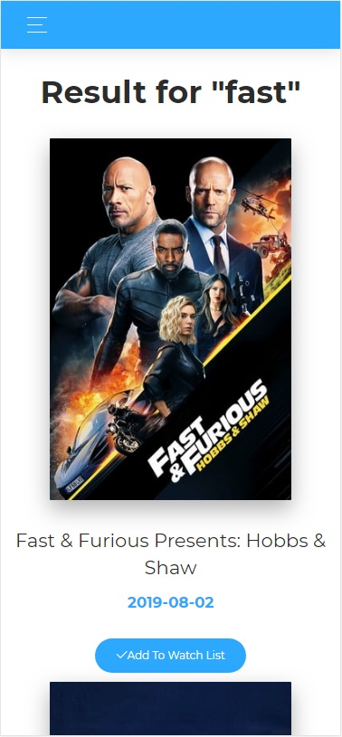

# Movie-List WebSite
Make a list of movies created with React.js, node.js, express.js, postgres
* https://movie-list-by-muli.herokuapp.com/

[![NPM Version][npm-image]][npm-url]
[![Build Status][travis-image]][travis-url]


Sign in or register to get started.


Search for the movies you want to see or have already seen by entering the movie title into the search bar


Select the movie by clicking "Add Movie to List" or by clicking the movie image,
We will add all the movies you click on to "Your List" tab


You can edit your list - delete, update, sort 


For more help you can enter to the How It Works page


And contact me in the same page


You can see all the information about me in the "about me" in every footer


Works on both mobile and tablets





## Sources

This web App uses now-ui-kit-react-master design from https://creative-tim.com.
The API is from The Movie DB  - https://www.themoviedb.org/

## Development setup

If you want to run this program on your local host you need first 
to download and run the Movie-List_server with

```
npm start
```
and then download and run this with

```
npm start
```

## Meta

Muli Orgatz –  muli652@gmail.com


<!-- Markdown link & img dfn's -->
[npm-image]: https://img.shields.io/npm/v/datadog-metrics.svg?style=flat-square
[npm-url]: https://npmjs.org/package/datadog-metrics
[npm-downloads]: https://img.shields.io/npm/dm/datadog-metrics.svg?style=flat-square
[travis-image]: https://img.shields.io/travis/dbader/node-datadog-metrics/master.svg?style=flat-square
[travis-url]: https://travis-ci.org/dbader/node-datadog-metrics
